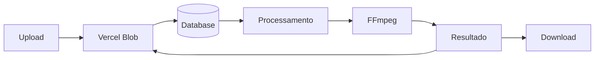

# HookScale - Video Combiner

Uma aplicação Next.js moderna para combinar vídeos de hooks e bodies automaticamente, gerando todas as combinações possíveis.

## 🚀 Features

- ✅ Upload drag & drop de vídeos MP4
- ✅ Processamento automático de todas as combinações
- ✅ Progresso em tempo real via Server-Sent Events
- ✅ Download individual ou em lote (ZIP)
- ✅ Dark mode
- ✅ Interface responsiva e moderna
- ✅ Processamento em lotes para otimização

## 🛠️ Stack Técnica

- **Framework**: Next.js 14+ (App Router)
- **TypeScript**: Tipagem forte
- **UI**: Tailwind CSS + componentes customizados
- **Storage**: Vercel Blob
- **Database**: Supabase (PostgreSQL)
- **Video Processing**: fluent-ffmpeg
- **Real-time**: Server-Sent Events (SSE)

## 📋 Pré-requisitos

- Node.js 18+
- FFmpeg instalado no sistema
- Conta Supabase (grátis)
- Conta Vercel com Blob Storage configurado

## 🔧 Instalação

1. Clone o repositório:
```bash
git clone <seu-repo>
cd hookscale
```

2. Instale as dependências:
```bash
npm install
```

3. **IMPORTANTE**: Configure as variáveis de ambiente:

Você precisa criar um arquivo `.env.local` na raiz do projeto com as credenciais do Supabase e Vercel Blob:

### Como obter as credenciais:

**a) Supabase (Database):**
1. Acesse [Supabase Dashboard](https://supabase.com/dashboard)
2. Crie um novo projeto
3. Vá em **Settings** → **API**
4. Copie:
   - **Project URL**: `NEXT_PUBLIC_SUPABASE_URL`
   - **service_role** key: `SUPABASE_SERVICE_ROLE_KEY`

**b) Criar tabelas no Supabase:**
1. Vá em **SQL Editor**
2. Execute o SQL em `lib/schema.sql` ou veja [SUPABASE_SETUP.md](./SUPABASE_SETUP.md)

**c) Vercel Blob Storage:**
1. Acesse [Vercel Dashboard](https://vercel.com/dashboard)
2. Vá em **Storage** → **Create Database** → **Blob**
3. Copie o `BLOB_READ_WRITE_TOKEN`

### Crie o arquivo `.env.local`:

```env
# Supabase (OBRIGATÓRIO)
NEXT_PUBLIC_SUPABASE_URL=https://xxxxx.supabase.co
SUPABASE_SERVICE_ROLE_KEY=eyJhbGciOiJIUzI1NiIsInR5cCI6IkpXVCJ9...

# Vercel Blob (OBRIGATÓRIO)
BLOB_READ_WRITE_TOKEN=vercel_blob_rw_XXXXXXXXXX

# Opcionais
MAX_FILE_SIZE_MB=100
BATCH_SIZE=8
```

**📖 Guia completo de setup: [SUPABASE_SETUP.md](./SUPABASE_SETUP.md)**  
**⚡ Início rápido: [QUICKSTART_SUPABASE.md](./QUICKSTART_SUPABASE.md)**

4. Execute o servidor de desenvolvimento:
```bash
npm run dev
```

5. Acesse `http://localhost:3000`

## 📁 Estrutura do Projeto

```
hookscale/
├── app/
│   ├── page.tsx                    # Página principal (upload)
│   ├── job/[id]/page.tsx          # Página de progresso do job
│   ├── layout.tsx                 # Layout raiz
│   ├── globals.css                # Estilos globais
│   └── api/
│       ├── upload/route.ts        # Upload para Blob
│       ├── process/route.ts       # Processamento SSE
│       ├── download/route.ts      # Download individual
│       ├── download-zip/route.ts  # Download ZIP
│       └── job/route.ts           # Detalhes do job
├── components/
│   ├── upload-zone.tsx            # Drag & drop
│   ├── progress-bar.tsx           # Barra de progresso
│   ├── video-list.tsx             # Lista de vídeos
│   ├── theme-toggle.tsx           # Toggle dark mode
│   └── ui/                        # Componentes base
├── lib/
│   ├── db.ts                      # Postgres client
│   ├── ffmpeg.ts                  # FFmpeg helpers
│   ├── blob-storage.ts            # Blob helpers
│   ├── video-processor.ts         # Lógica de processamento
│   └── utils.ts                   # Utilitários
└── types/
    └── index.ts                   # TypeScript types
```

## 🎯 Como Usar

1. **Upload**: Arraste ou selecione vídeos de hooks e bodies (apenas .mp4)
2. **Combinações**: Visualize quantas combinações serão geradas
3. **Processar**: Clique em "Gerar Combinações" e aguarde o processamento
4. **Download**: Baixe vídeos individualmente ou todos em ZIP

## 🔄 Fluxo de Processamento



## 🚀 Deploy na Vercel

1. Conecte seu repositório no Vercel
2. Configure as variáveis de ambiente:
   - `NEXT_PUBLIC_SUPABASE_URL`
   - `SUPABASE_SERVICE_ROLE_KEY`
   - `BLOB_READ_WRITE_TOKEN`
3. Habilite Vercel Blob Storage
4. Deploy!

**Importante**: Use o plano Vercel Pro para funções com até 5 minutos de duração.

## ⚙️ Configurações

### Tamanho de Lote
Ajuste `BATCH_SIZE` no `.env.local` para controlar quantos vídeos são processados simultaneamente (padrão: 8).

### Tamanho Máximo de Arquivo
Ajuste `MAX_FILE_SIZE_MB` para limitar o tamanho dos vídeos (padrão: 100MB).

### FFmpeg
Se necessário, configure `FFMPEG_PATH` para apontar para o binário do FFmpeg.

## 🐛 Troubleshooting

### FFmpeg não encontrado
- Certifique-se de que o FFmpeg está instalado no sistema
- Configure `FFMPEG_PATH` no `.env.local`
- Para Vercel, use um layer ou static binary

### Timeout na Vercel
- Reduza o `BATCH_SIZE`
- Use vídeos menores
- Certifique-se de estar no plano Vercel Pro

### Erros de conexão com banco
- Verifique as variáveis de ambiente do Supabase
- Certifique-se de que as tabelas foram criadas no Supabase Dashboard (veja [SUPABASE_SETUP.md](./SUPABASE_SETUP.md))
- Teste a conexão: `npx tsx test-supabase.ts`

## 📝 License

MIT

## 🤝 Contribuições

Contribuições são bem-vindas! Sinta-se à vontade para abrir issues ou pull requests.
